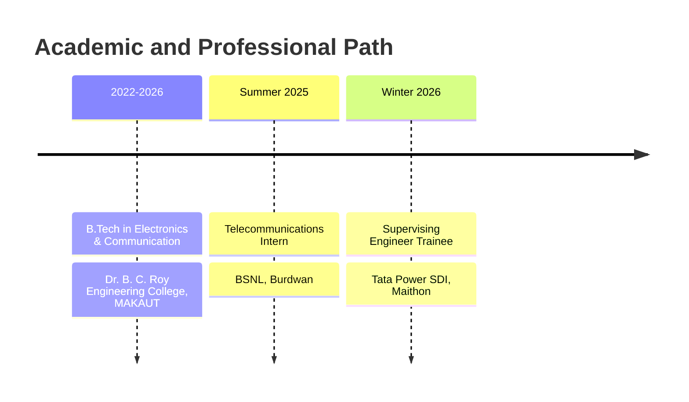
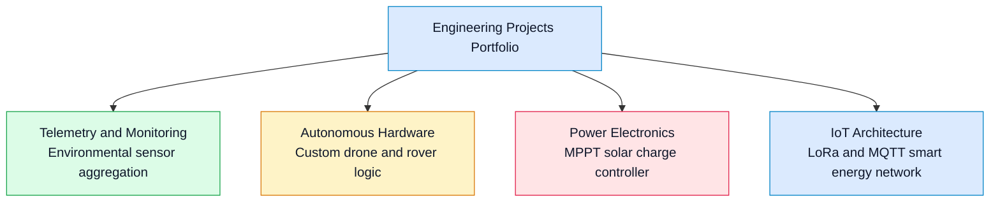
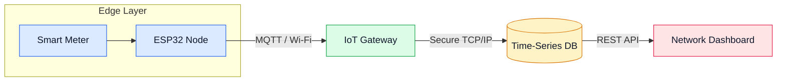

#  Supratim Mondal

**EC Engineer**  
 Sainthia / Durgapur, India |  mail@supratim.qzz.io |  [Website](https://supratim.qzz.io)

  
  
  

---

##  About

Final-year B.Tech student in ECE at Dr. B. C. Roy Engineering College (batch 2026). I specialize in designing embedded systems, telecommunications infrastructure, and resilient network architectures. Recent work includes wireless smart energy telemetry, custom MPPT solar controllers, and IoT network deployment. Interned at BSNL (telecom) and Tata Power SDI.

---

##  Education & Experience

---

##  Projects

**System Architecture: Wireless Smart Energy Network**

---

##  Skills

**Hardware & Embedded**  

**Telecom & Networking**  

**Lab & Test Equipment:**  
 Oscilloscope |  Multimeter |  Logic Analyzer |  Signal Generator

---

##  Research

- Weather-integrated predictive energy management for hybrid solar.
- MPPT SCC design with INC algorithm.

---

##  Contact

  
  
  
  
  

